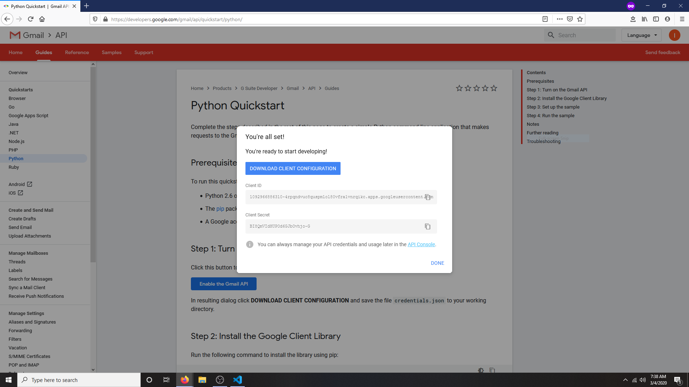
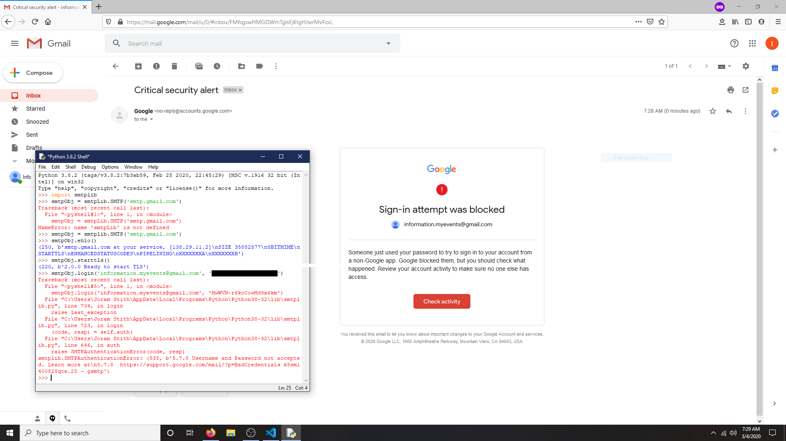
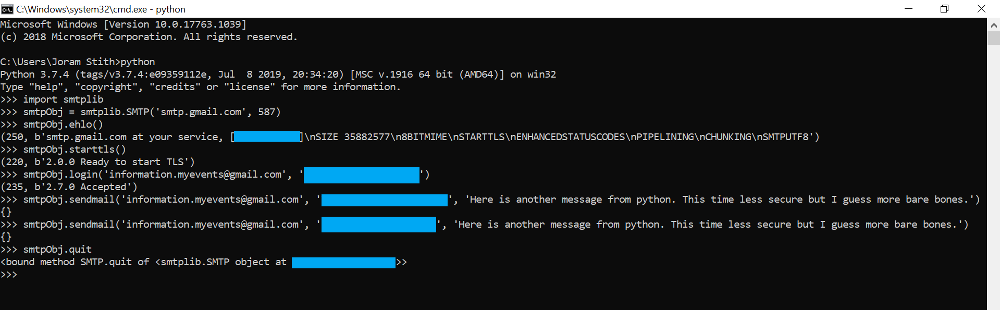
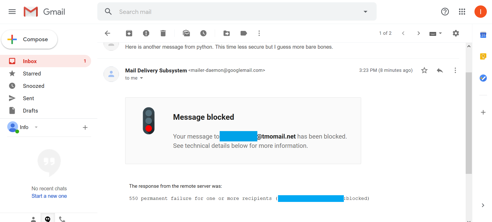
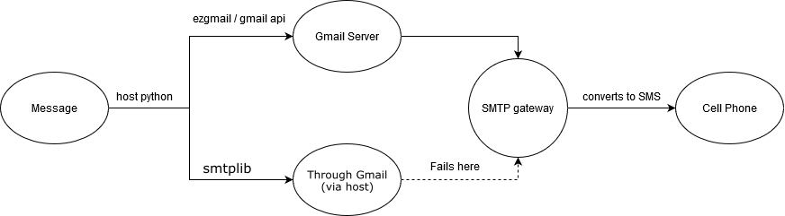

__Python Texter__
=================

By: _Jstith_

### A little background

Earlier on this year, I started playing around with the [Social Engineering Toolkit](https://www.trustedsec.com/tools/the-social-engineer-toolkit-set/). One of the working tools in that program was a bot that could sent email or text messages to any address/number. I loved this idea, but sadly it didn't work. Recently, I picked up a [book from No Starch Press](https://automatetheboringstuff.com/), and I learned how the S.E.T. tried to accomplish this goal, and why it didn't work anymore. I'll go into more detail about that later. I learned about a workaround, and wrote a python script that allows you to text any number from a gmail account via python using the _ezgmail_ library and the _gmail developer API_.

### Some assembly required

There is a little prep work needed to set this program up. Firstly, you need to install ezgmail in pip with
```bash
pip install --user --upgrade ezgmail
```
Next step is to log into whatever gmail account you plan to use. I would recommend against using a personal one because people can send responses to the email and you don't want to get spammed. Go to https://developers.google.com/gmail/api/quickstart/python/ and push the big red button (literally). You'll get the option to download a .json file with called `credentials.json`. Do so and put it in the same directory as your python file.



The third step is setting up ezgmail. Open an interactive python shell (you can use the terminal, IDLE, or whatever you chose) and enter the following
```python
import ezgmail, os
os.chdir(r'C:/PATH_TO_CREDENTIALS_DIRECTORY')
ezgmail.init()
```
This creates another json file called `token.json`. I'm not 100% sure about this, but I'm pretty sure this needs to be in the same directory as the other json file. At this point, the program should be ready to run.

### The code

```python
import ezgmail

# List of domain names for SMTP gateways for wireless providers
domainNames = {
    "AT&T": "txt.att.net",
    "Boost-Mobile": "sms.myboostmobile.com",
    "Cricket": "sms.cricketwireless.com",
    "Google-Fi": "msg.fi.google.com",
    "Metro-PCS": "mymetropcs.com",
    "Republic-Wireless": "text.republicwireless.com",
    "Sprint": "messaging.sprintpcs.com",
    "T-Mobile": "tmomail.net",
    "U.S.-Cellular": "email.uscc.net",
    "Verizon": "vtext.com",
    "Virgin-Mobile": "vmobl.com",
    "XFinity-Mobile": "vtext.com"
}

# Gets carrier and number from user
print("Enter provider of target number (0 if unknown/force):")
for x in domainNames:
    print('\t', x)
carrier = input()
number = input("Enter target number:\t")

# Formats the number to get rid of extraneous characters
number = number.replace('-', '')
number = number.replace('(', '')
number = number.replace(')', '')
number = number.replace(' ', '')

# Gets message to send
message = input("Enter message:\t")

# Formats address and sends email
if(carrier == '0'):
    # Brute forces all domains (phone numbers are unique so only one will work)
    # Fair warning, you'll get your email flodded with failed message announcements if you do this
    for x in domainNames:
        address = "" + number + "@" + domainNames[x]
        ezgmail.send(address, "/", message)
else:    
    address = "" + number + "@" + domainNames[carrier]
    ezgmail.send(address, "/", message)

```
### How does it work?

Emails, text messages, and other forms of online communication can all be broken down into text formatted in certain ways, according to protocols that dictate how the message should be formatted. Simple Mail Transfer Protocol (SMTP) dictates email, and Short Messaging Service (SMS) dictates text messaging. This program uses the gmail api to send a SMTP message, but sends it to what's called a SMTP gateway, which is a server that converts SMTP messages into other formats (in our case SMS). From there, the server sends the SMS to the phone number specified in the call.

### Why didn't the S.E.T's service work?

 You can't really send SMS messages straight to phones because they fall under different providers' domains, but sending SMTP is more simple. The S.E.T tried to use an old, open sourced library that goes directly through a registered SMTP account (email account) to send the information itself. Modern email accounts, however, recognize this traffic as sketchy and blocks it. I tried to connect to a gmail account using that method, and this was the result:

 
 
 Courtesy of [Soups71](https://github.com/Soups71), I learned about a way to bypass the spam protection on gmail. You can go to https://myaccount.google.com/lesssecureapps?pli=1 and turn off a setting that blocks Google's self-deemed _"less secure apps"_ from accessing your email. Doing so allows you to use the _smtplib_ library with some success. You can execute the following code to send an email

 

 ### _However_, I was _not_ successful in sending an email to the smtp gateway. I got a message that looks like this

 

 *** I blurred out relevant information for my logins, if you want to see the whole page it's in chapter 18 of [the book](https://automatetheboringstuff.com/).

 So I looked for a workaround, and found the gmail developer api. This lets you connect to gmail's servers using a credentials key, and send the SMTP message from gmail's servers, not from your computer.

 

 ### Imperfections / other options

 As is the case with any work-around, this solution is limited. There is no way to confirm that your message was delivered, or that it was delivered to the correct person. They can respond, but sometimes the email sends with the text as an attachment, which is annoying. If somebody wants to automate that process (the same library has the necessary tools), send it my way I'll post it here. There are a few other options. You can use a third party SMS gateway service such as [Twilio](https://twilio.com). Features such as these tend to be either unreliable or not free, but they still do the trick. 

 ### Final thoughts

 I think being able to send SMSs over python is a much more applicable tool for social engineering than email is in many settings. We're trained to watch out for sketchy emails, but we get automated text messages all the time, and we frequently click links in them without validating the source at all. If you stop and think about all the things you get automated text messages for, you'll quickly see how being able to automate this process can be a valuable tool in social engineering.
 
 Happy coding, stay safe, and make good choices.

-- _Jstith_
